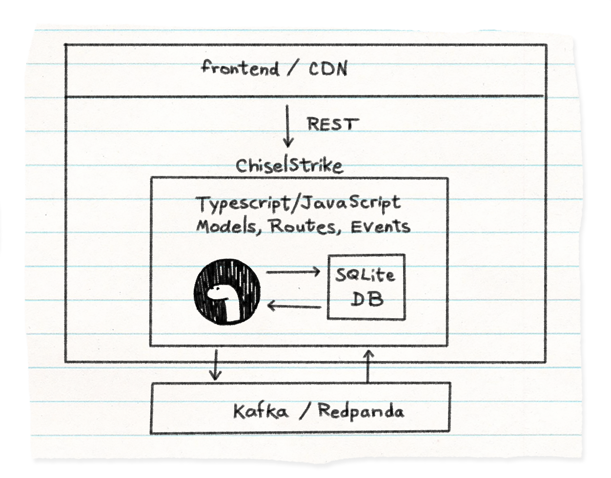

---

[](https://github.com/chiselstrike/chiselstrike/actions)
[](https://github.com/chiselstrike/chiselstrike/blob/master/LICENSE)
[](https://discord.gg/GHNN9CNAZe)
[](https://twitter.com/chiselstrike)

## What is ChiselStrike?

ChiselStrike is a complete backend bundled in one piece. Your one stop-shop for all
your backend needs, powered by TypeScript.

## Why ChiselStrike?

Putting together a backend is hard work. Databases? ORM? Business logic? Data
access policies? And how to offer all of that through an API?

Learning all that, plus figuring out the interactions between all the
components can be a drain on an application developer's time. Low-code
based approaches allow for super fast prototypes, but as you need to scale and
evolve, the time you saved on the prototype is now owed with interest in refactorings,
migrations, etc.

ChiselStrike provides everything you need to handle and evolve your backend,
from the data layer to the business logic, allowing you to focus on what you
care about – your code, rather than worrying about databases schemas,
migrations, or even database operations.

All driven by TypeScript, so your backend can evolve as your code evolves.

## How does that work?

ChiselStrike keeps things as close as possible to pure TypeScript, and a
[translation
layer](https://blog.chiselstrike.com/my-other-database-is-a-compiler-10fd527a4d78)
takes care of index creation, database query generation, and even communicating
with external systems like Kafka.

Internally, ChiselStrike uses a SQLite database so there's no need to set up
any external data layer (although it is possible to hook up an external
Postgres-compatible database).  ChiselStrike also abstract other concepts
common to complex backends, like
[Kafka-compatible](https://blog.chiselstrike.com/dear-application-developer-how-far-can-you-really-go-without-a-message-queue-d9e5385fab64)
streaming platforms.



## Quick start

To get a CRUD API working in 30 seconds or less, first create a new project:

```console
npx -y create-chiselstrike-app@latest my-app
cd my-app
```

Add a model by writing the following TypeScript code to `models/BlogComment.ts`:

```typescript
import { ChiselEntity } from "@chiselstrike/api"

export class BlogComment extends ChiselEntity {
    content: string = "";
    by: string = "";
}
```

Add a route by writing the following TypeScript code to `routes/comments.ts`:

```typescript
import { BlogComment } from "../models/BlogComment";
export default BlogComment.crud();
```

Start the development server with:

```console
npm run dev
```

This server will provide a CRUD API that you can use to add and query instances
of the BlogComment entity.

```console
curl -X POST -d '{"content": "First comment", "by": "Jill"}' localhost:8080/dev/comments

curl localhost:8080/dev/comments
```

For a more detailed tutorial about how to get started with ChiselStrike, follow
our [Getting started tutorial](https://cs.docs.chiselstrike.com/tutorials/getting-started/).

### Is ChiselStrike a database?

No. The [founding team at ChiselStrike](https://chiselstrike.com/about-us) have written databases from scratch before and
we believe there are better things to do in life, like pretty much anything else. ChiselStrike comes bundled with SQLite,
providing developers with a zero-conf *relational-like abstraction* that allows one to think of backends
from the business needs down, instead of from the database up.

Instead, you can think of ChiselStrike as a big pool of global shared memory.
The data access API is an integral part of ChiselStrike and offers developers a way to just code, without
worrying about the underlying database (anymore than you worry about what happens in each level of the memory hierarchy,
meaning some people do, but most people don't have to!).

In production, ChiselStrike can also hook up into a
[Kafka-compatible](https://blog.chiselstrike.com/dear-application-developer-how-far-can-you-really-go-without-a-message-queue-d9e5385fab64)
streaming platform when available, and transparently drive both that and the database from a unified TypeScript/JavaScript abstraction.

### Is ChiselStrike an ORM?

Kind of. ChiselStrike has some aspects that overlap with traditional ORMs, in that it allows you to access database abstractions
in your programming language. However, in traditional ORMs you start from the database, and export it up. Changes
are done to the database schema, which is then bubbled up through *migrations*, and elements of the database invariably leak
to the API.

ChiselStrike, on the other hand, starts from your code and automates the decisions needed to implement that into the database, much
like what a [compiler](https://blog.chiselstrike.com/my-other-database-is-a-compiler-10fd527a4d78) would do.

Let's look at [ChiselStrike's documentation](https://cs.docs.chiselstrike.com/Intro/first) for an example of what's needed to create a comment on a blog post:

```typescript
import { ChiselEntity } from "@chiselstrike/api"

export class BlogComment extends ChiselEntity {
    content: string = "";
    by: string = "";
}
```

The first thing you will notice is that there is no need to specify how those things map to the underlying database. No tracking
of primary keys, column types, etc.

Now imagine you need to start tracking whether this was created by a human or a bot. You can change your model
to say:

```typescript
import { ChiselEntity } from "@chiselstrike/api"

export class BlogComment extends ChiselEntity {
    content: string = "";
    by: string = "";
    isHuman: boolean = false;
}
```

and that's it! There are no migrations and no need to alter a table.

Furthermore, if you need to find all blog posts written by humans, you
can just write a lambda instead of trying to craft a database query in TypeScript:

```typescript
const all = await BlogComment.findMany(p => p.isHuman);
```

### Is ChiselStrike a TypeScript runtime?

ChiselStrike includes a TypeScript runtime - the fantastic and beloved [Deno](https://github.com/denoland/deno). That's the last piece of the puzzle
with the data API and the database bundles. That allows you to develop everything locally from your laptop and integrate
with your favorite frontend framework. Be it Next.js, Gatsby, Remix, or any others - we're cool with all of them!

### That's all fine and all, but I need more than that!

We hear you. No modern application is complete without authentication and security. ChiselStrike integrates with [next-auth](https://next-auth.js.org/)
and allows you to specify authentication entities directly from your TypeScript models.

You can then add a policy file that details which fields can be accessed, and which endpoints are available.

For example, you can store the blog authors as part of the models,

```typescript
import { ChiselEntity, AuthUser } from "@chiselstrike/api"

export class BlogComment extends ChiselEntity {
    content: string = "";
    @labels("protect") author: AuthUser;
}
```

and then write a policy saying that the users should only be able to see the posts that they themselves
originated:

```yaml
labels:
  - name: protect
    transform: match_login
```

Now your security policies are declaratively applied separately from the code, and you can easily grasp what's
going on.

## In Summary

ChiselStrike provides everything you need to handle your backend, from the data layer to the business logic, wrapped in powerful abstractions that let you just code and not worry about handling databases schemas, migrations, and operations again.

It allows you to declaratively specify compliance policies around who can access the data and under which circumstances.

Your ChiselStrike files can go into their own repo, or even better, into a subdirectory of your existing frontend repo. You can code your presentation and data layer together, and turn any frontend framework into a full-stack (including the database layer!) framework in minutes.

## Contributing

To build and develop from source:

```console
git submodule update --init --recursive
cargo build
```

That will build the `chiseld` server and `chisel` utility.

You can now use `create-chiselstrike-app` to install a local version of the API:
```console
node ./packages/create-chiselstrike-app --chisel-version="file:../packages/chiselstrike-api" my-backend
```

And then replace instances of `npm run` with direct calls to the new binaries. For example, instead of
`npm run dev`, run

```console
cd my-backend
npm i esbuild
../target/debug/chisel dev
```

Also, consider:

[Open (or fix!) an issue](https://github.com/chiselstrike/chiselstrike/issues) 🙇‍♂️

[Join our discord community](https://discord.gg/GHNN9CNAZe) 🤩

[Start a discussion](https://github.com/chiselstrike/chiselstrike/discussions/) 🙋‍♀️


## Next steps?

Our documentation (including a quick tutorial) is available at [here](https://cs.docs.chiselstrike.com)
